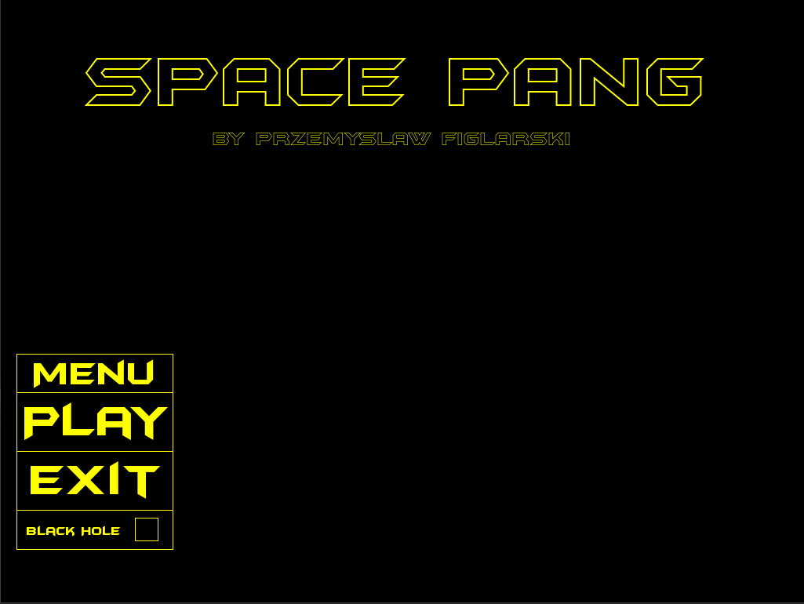
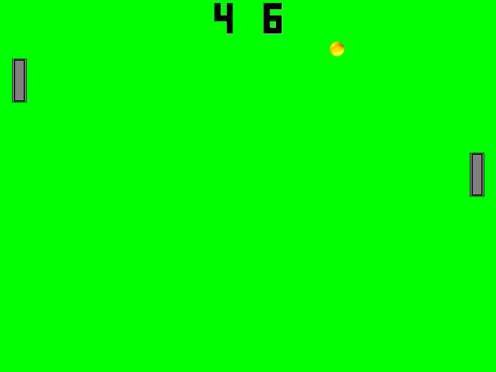

Pang was my first project using SFML and C++ and also the first game I made. It is a simple Pong clone with a simple AI opponent. 
It is also possible to add a "black hole" to the gameplay which when hit by the ball will move it to a random position on the screen.    

